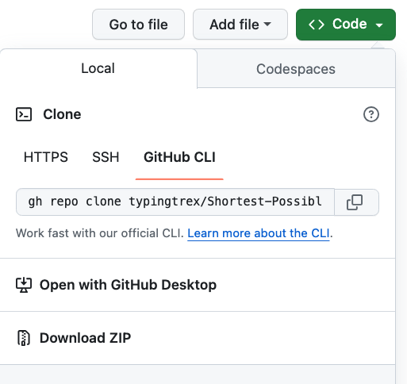
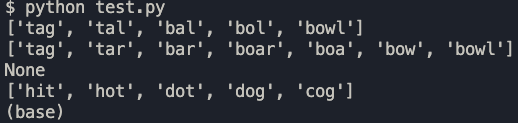

<!-- For the Users of this Function -->

# Shortest-Possible-Path

Welcome! Shortest-Possible-Path is a repository that holds a Python3 function that takes three parameters:

- start word
- end word
- dictionary (list)

and returns the shortest possible pathway from the start word to the end word by changing one letter at a time. Each intermediate word must exist in the given dictionary. Result is in a list format containing the start word, all intermediates, and the end word. Return _None_ if there are no paths from start to end.

## Description Overview:

- Both the start and end words are lowercase alphabetic strings.
- The start and end words can be different lengths.
- Only one letter can be changed, added, or deleted at a time.

  1. Change: change a letter in the word to another letter in the alphabet
     - (i.e. "bat" -> change "a" for "e" -> "bet")
  2. Add: add a letter to the start string
     - (i.e. "bat" -> add "i" at index 2 -> "bait")
  3. Delete: delete a letter from the start string
     - (i.e. "hate" -> delete "e" at index 3 -> "hat")

- Each intermediate word must exist in the dictionary of words.
- The solution is returned as a list

  - ["bet", "bat", "bad"]

  OR

  _None_ if there is no possible path.

## Prerequisites:

- Python 3.11.5 or higher

## Installation:

- You can use this function by downloading the repository as a ZIP file or by cloning the repository.
  

### Download as a ZIP file

1. Click on the **Code** button and click on **Download ZIP**.
2. Go to your computer's download file and click on the zip to open the downloaded folder.
3. To extract the function drag the **shortestPossiblePathFunction.py** file to your project folder.

### Download by cloning the repository 

1.  Click on the **Code** button and click on **HTTPS**.
2.  Copy the url or click on the button next to it to copy the link.
3.  Open your terminal and navigate to destination folder for this repository
4.  Type into your terminal the command "git clone" and paste the URL.

        git clone https://github.com/typingtrex/Shortest-Possible-Path.git

## Using the function

1.  **IMPORT**:

- Go to your code editor and open the file, where you'd like to use the function shortestPossiblePath.
- Import the function by adding the line below:

        from <PATH TO FILE> import shortestPossiblePath

- Call shortestPossiblePath by passing in **start word**, **end word**, and **dictionary**

        first = "tag"
        last = "bowl"
        dictionary = ["tag", "tar", "bar", "boar", "boa", "bow", "bowl", "fowl", "rag", "tal", "bal", "bol"]

        shortestPossiblePath(first, last, dictionary)

2. **RUNNING FROM TERMINAL**:

- If you cloned the repository, go to your terminal and **cd** (navigate) to your **Shortest-Possible-Path** directory
- Type in your terminal

          python test.py

  This will run the sample test file and will print the results in your terminal.

  
